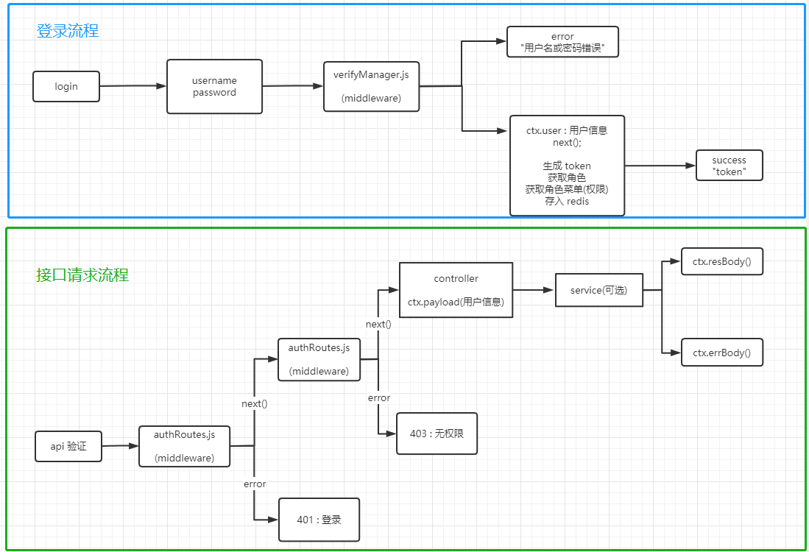

### eggAuthSystem


#### 介绍

​	egg.js + vue.js 的后台管理模板。

​	**同国内码云地址: https://gitee.com/sxczykn/egg-auth-system**


#### 示例

​	地址: http://egg.yls.red

​	超级管理员: superAdmin  123456

​	管理员: admin  123456

​	游客: text  123456


#### 软件架构

- manange_views 前端代码

  - vue2
  - vuex
  - axios
  - vue-router
  - element-ui


- server 后端代码

  - egg.js
  - redis
  - sequelize
  - mysql


#### 安装教程

##### 前端
``` shell
cd manage_views

yarn
// or
npm install
```

##### 后端
``` shell
cd server

yarn
// or
npm install
```


#### 使用说明

##### 1.egg 服务端

###### 目录介绍

​	*其他目录可参考 egg.js 文档。*

```code
> init
  - egg_auth.sql  // 数据库初始文件
> app
  - controller  // 路由方法目录
  - extend      // egg 框架扩展目录
  - middleware  // 中间件目录
  - model       // sequelize 模型目录
  > modules     // 自定义的模块目录
    - BaseController.js     // 自定义扩展的 controller 模块
    - BaseService.js        // 自定义扩展的 service 模块
  - public      // 静态目录
  - routes      // 路由接口目录
  - service(可选)     // 业务处理模块
  - validator(可选)   // 数据校验目录
```


###### 流程




###### 接口定义模块(controller)

```javascript
# test.js
const BaseController = require('../modules/BaseController');
const MODULE_KEY = 'test';    // 与验证模块要使用的文件同名

class ManagerController extends BaseController {
  init() {
    this.MODULE_KEY = MODULE_KEY;
    this.setEntity(this.ctx.model.Test);    // 设置关联 mdoel
    this.setService(this.service.test);    // 设置关联 service
  }
}

module.exports = ManagerController;
```


###### 业务处理模块(service)

```javascript
# test.js
const BaseService = require('../modules/BaseService');

class TestService extends BaseService {
}

module.exports = TestService;
```


###### 验证模块(validator)

```javascript
# test.js
module.exports = app => {
  const Joi = app.Joi;

  // 创建单个的验证
  const create = Joi.object().keys({
    name: Joi.string().required().error(new Error('角色名称不存在')),
    // ...
  });

  // 分页查询的验证
  const page = Joi.object().keys({
    page: Joi.number().default(1),
    limit: Joi.number().default(20),
    // ...
  });

  // 按 id 更新单个的验证
  const update = Joi.object().keys({
    name: Joi.string().required().error(new Error('角色名称不存在')),
    id: Joi.number().required().error(new Error('角色id不存在')),
    // ...
  });

  // 按 id 删除单个的验证
  const remove = Joi.object().keys({
    id: Joi.number().required().error(new Error('角色id不存在')),
    // ...
  });

  return {
    create,   // 创建的验证名
    page,    // 分页查询的验证名
    update,   // 按 id 更新单个验证名
    remove,   // 按 id 删除单个验证名
    item: remove,   // 按 id 查询单个的验证名
  };
};
```


###### 路由模块(routes)

​	*因为个人不是特别喜欢 egg.js 的 RESTful 规范，所以没有使用。*

```javascript
# test.js
module.exports = app => {
  const { router, controller } = app;
  router.get('/api/test', controller.manager.page);      // 分页查询
  router.get('/api/test/:id', controller.manager.item);   // 按 id 查询单个
  router.get('/api/test/list', controller.manager.list);  // 查询所有
  router.post('/api/test', controller.manager.create);    // 创建单个
  router.put('/api/test/:id', controller.manager.update);   // 按 id 更新单个
  router.delete('/api/test', controller.manager.remove);    // 按 id 删除多个
};
```


##### 2.vue 前端

###### 目录介绍

​	*其他目录可参考 vue.js 文档、vue-element-admin 文档。*

```code
> src 
  > api
  	- config axios // 配置目录
  	- xx.js // 接口文件(按需引入)
  - assets // 静态资源
  - components // 组件
  - directive // 自定义指令
  - filters // 过滤器
  - layout // 布局容器
  - plugins	// 插件
  - router // 路由(静态)
  - store // vuex
  - style // 样式
  - utils // 工具
  - views // 页面
  - main.js // vue 入口函数
  - permission.js // 登录验证
  - settings.js // 一些配置
```


###### 自定义指令

​	v-rule: 接受一个字符串(即规则)作为参数，无权限时则按钮禁用。

```vue
<el-button v-rule="'menu:delete'" type="danger" icon="el-icon-delete" @click="handleRemove">删除</el-button>
```

​	

#### 部署

```code
nginx 配置
server
{
    listen 80;
    server_name egg.yls.red;
    index index.html index.htm index.php;
    root  /www/server/phpmyadmin;

    #error_page   404   /404.html;
    include enable-php.conf;

    location /upload/ {
        alias /home/www/egg-auth-system/server/app/public/upload/;
    }

    location / {
        try_files $uri $uri/ /index.html;
        index index.html;
        alias /home/www/egg-auth-system/manage_views/dist/;
    }

    location /api/ {
        proxy_pass http://127.0.0.1:7001;
    }

	access_log  /www/wwwlogs/access.log;
}
```

